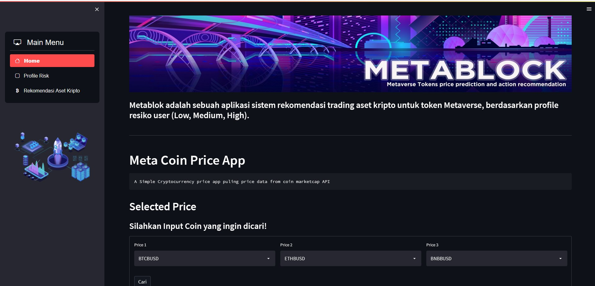
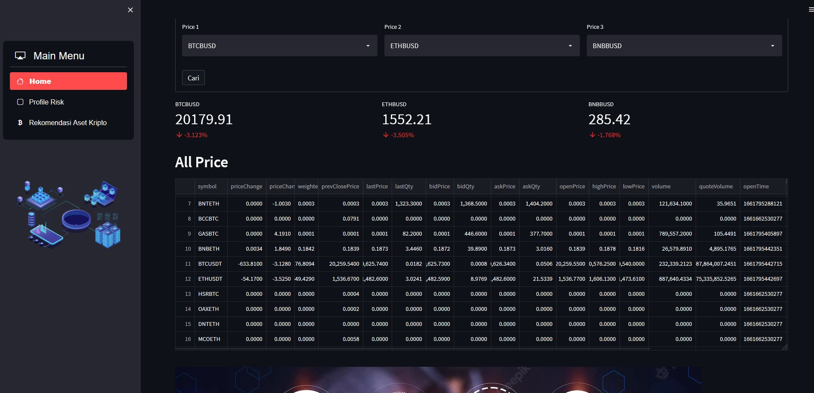

# MetaBlock!

  

By [Rahmad Gunawan dan Suhardiman Agung]
## Dashboard

The dataset Metaverse Crypto Tokens Historical data, Top leading and buzzing metaverse tokens

**MetaBlock!** adalah sebuah aplikasi sistem rekomendasi trading aset kripto untuk token Metaverse, berdasarkan profile resiko user (Low, Medium, High)..

## Latar Belakang

Our app provides AI-based recommendation system to invest in metaversal tokens. Problems that we are trying to solve include:
Metaversal token has high volatility and AI may help in managing investment risk
There are hundreds of metaversal tokens in the market and it is difficult to keep track of those asset classes. AI may help in automating some of the processes and monitoring those coins

There are a high degree of frauds occurring in the metaverse. We help you select tokens that have lower risk

## Demo Aplikasi

  
  

  Tampilan dari laman beranda

  
  

  Tampilan dari laman beranda

---

Untuk menggunakan aplikasi cukup mudah, cukup ganti laman yang telah disediakan pada navigation menu untuk menuju menu 'Home', 'Profile Risk' dan 'Rekomendasi Aset Kripto' dimana anda akan diarahkan untuk mengisi profile risk user dan kemudian akan mengetahui bagaimana profile risk user tersebut, dan kemudian adalah Rekomendasi Aset Kripto Sesuai dengan profile risk user tersebut.

  
  

  Tampilan dari laman Profile Risk

  
  

  Tampilan dari laman Profile Risk

---

  
  

  Tampilan dari laman skema Rekomendasi Aset

## Contributor
1. [Rahmad Gunawan](https://github.com/rahmad07g)
2. [Suhardiman](https://github.com/sumankwan)